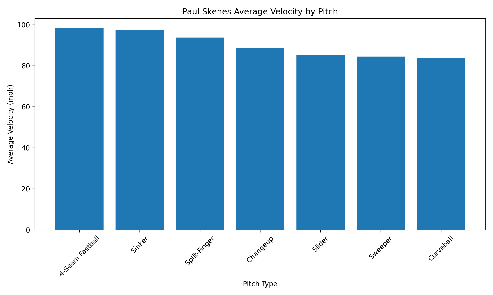
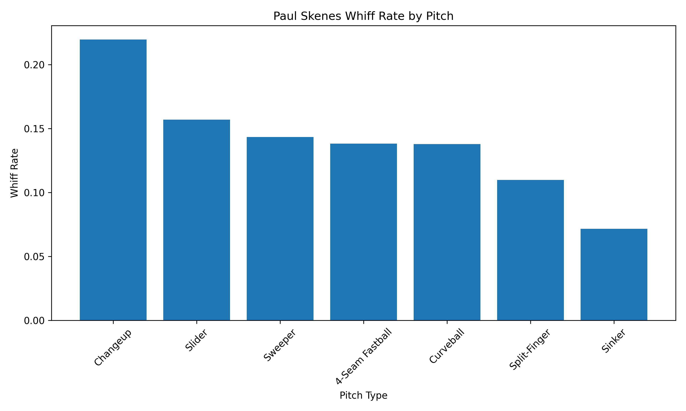
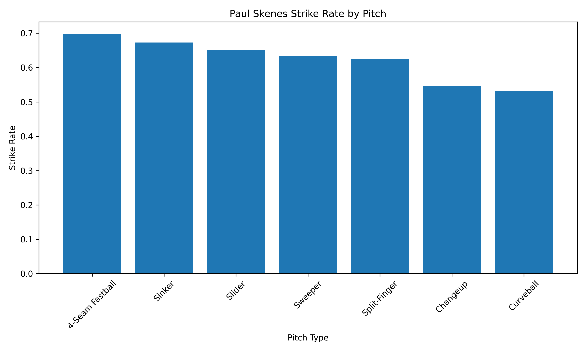

# MLB Pitch Arsenal Analyzer

This project analyzes Paul Skenes' 2025 pitch arsenal using Statcast data from `pybaseball`. The notebook pulls pitcher-level pitch data, cleans the core columns, summarizes pitch usage, and creates charts for velocity, whiff rate, and strike rate.

## Scouting Summary

Paul Skenes' arsenal is built around premium velocity and a deep mix of secondary pitches. Across 3,207 tracked pitches from March 11, 2025 through September 24, 2025, his four-seam fastball was the foundation of the profile, accounting for 39.5% of pitches at an average velocity of 98.2 mph. He also featured a hard sinker at 97.6 mph and a split-finger at 93.7 mph, giving him multiple power offerings that can attack different parts of the zone.

The strongest swing-and-miss result came from the changeup, which produced a 22.0% whiff rate despite being used only 10.8% of the time. The slider and sweeper also generated above-average miss rates, giving Skenes several ways to finish at-bats beyond simply overpowering hitters with fastball velocity.

From a command perspective, the four-seam fastball and sinker were the most reliable strike-getters, with strike rates of 69.8% and 67.3%. That combination gives Skenes a strong base for getting ahead in counts, while his changeup, sweeper, slider, and split-finger provide different shapes for chase and weak contact.

## Pitch Mix

| Pitch | Usage Rate | Avg Velocity | Whiff Rate | Strike Rate |
|---|---:|---:|---:|---:|
| 4-Seam Fastball | 39.5% | 98.2 mph | 13.8% | 69.8% |
| Sweeper | 15.7% | 84.5 mph | 14.3% | 63.3% |
| Split-Finger | 14.2% | 93.7 mph | 11.0% | 62.4% |
| Changeup | 10.8% | 88.7 mph | 22.0% | 54.6% |
| Sinker | 10.0% | 97.6 mph | 7.2% | 67.3% |
| Slider | 5.4% | 85.3 mph | 15.7% | 65.1% |
| Curveball | 4.5% | 83.9 mph | 13.8% | 53.1% |

## Charts

## LinkedIn Summary

I built a Python project analyzing Paul Skenes' 2025 pitch arsenal using Statcast data from `pybaseball`.

The analysis looks at pitch usage, average velocity, whiff rate, and strike rate by pitch type. Skenes' profile is built around elite fastball velocity, with his four-seam fastball averaging 98.2 mph and making up 39.5% of his pitch mix. His sinker also averaged 97.6 mph, giving him two high-velocity fastball shapes.

The most interesting finding was the changeup. Even though it made up just 10.8% of his pitches, it produced the highest whiff rate in the arsenal at 22.0%. That gives Skenes a strong swing-and-miss complement to his power fastball approach.

This project helped me practice working with baseball data, cleaning Statcast outputs, building grouped summaries in pandas, and creating visual scouting outputs with matplotlib.

## Tools Used

- Python
- pandas
- matplotlib
- pybaseball
- Jupyter Notebook
